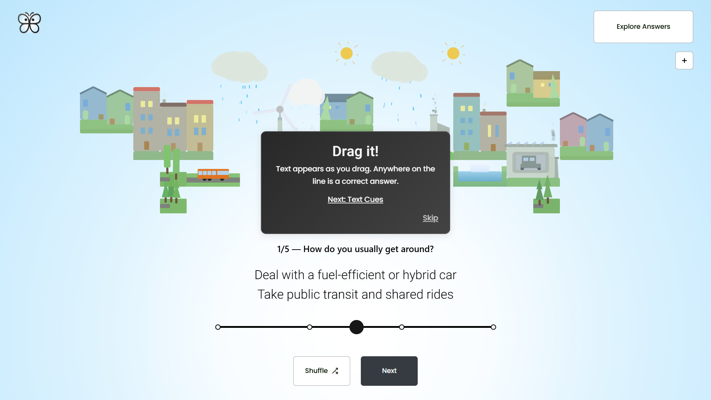

# 🌍 Participatory Climate App — 3D Interactive Survey Experience

<div style="display: flex; flex-direction: row; flex-wrap: wrap; justify-content: center; gap: 1rem;">
  
  
</div>


**Participatory Climate App** is a fully interactive web application that visualizes survey results about climate change in a **gamified 3D environment**.  

After completing a short climate survey, users receive **personalized feedback** represented through anchored to the world, color-coded cards and can explore **other participants’ results** in a live, orbitable 3D world.

---

## 🎮 Features

- 🧩 **Gamified Feedback Cards**  
  Personalized results based on each answer — with dynamic gradients, and contextual tone.

- 🌐 **3D Visualization with Three.js & React Three Fiber**  
  Explore other survey takers’ results floating in space — zoom, orbit, and interact with dynamic nodes.

- 🖼️ **Custom 2D Canvas Engine**  
  A lightweight, hand-built engine (not dependent on p5.js or PixiJS) for drawing animated environmental shapes like trees, houses, and clouds.

- 🧭 **Responsive & Touch-Ready UI**  
  Pinch-zoom, drag, rotate, and toggle elements fluidly — with accessibility and motion-sickness safeguards.

- ⚙️ **Dynamic Offset Anchoring System**  
  Keeps 2D DOM elements visually attached to their 3D anchors, even during zooming or camera movement.  
  Handles viewport edge cases automatically using `.is-top`, `.is-bottom`, etc. classes.

---

## 🧠 Technical Highlights

### 🎯 Bridging 3D Context with React DOM

The app integrates **Three.js (via React Three Fiber)** and **React DOM** through a custom anchoring system.  
Normally, `@react-three/drei`’s `Html` component struggles to keep labels aligned during camera motion.  
This project introduces a **dynamic offset value system** to preserve spatial alignment and visual consistency.

```js
transform: translateX(var(--offset-px));
