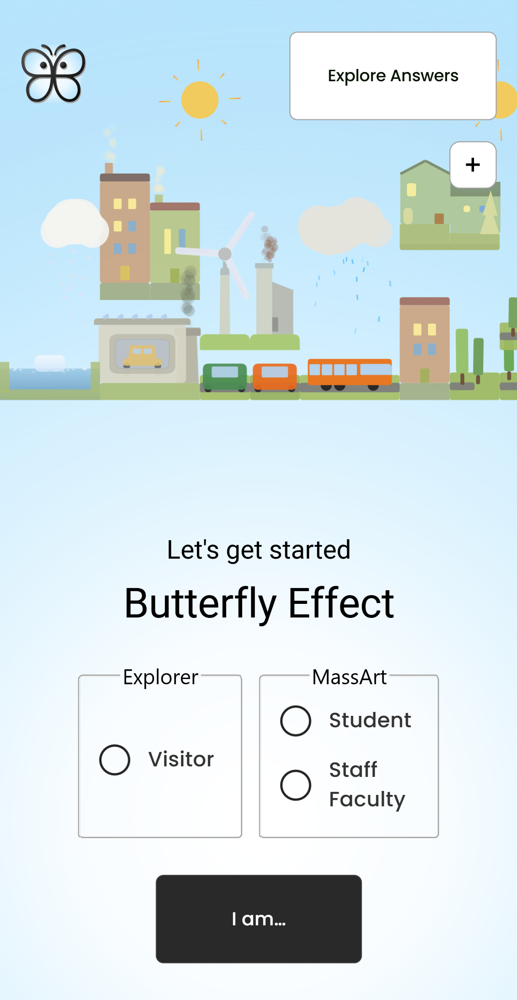
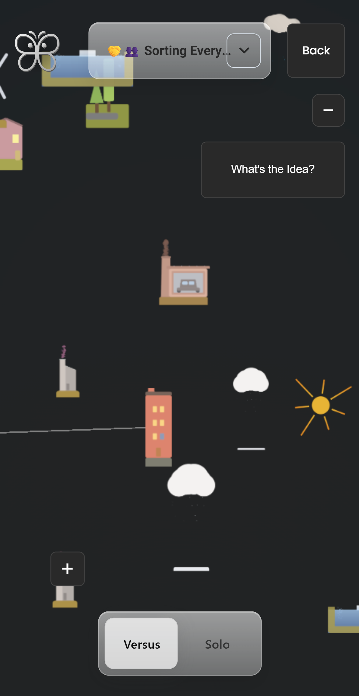
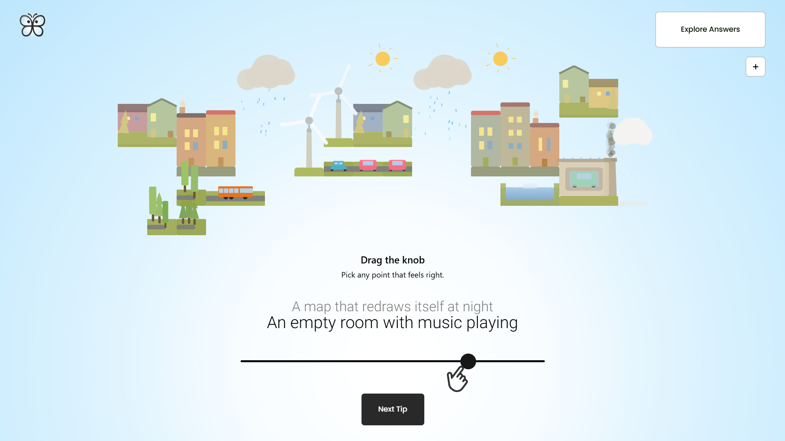
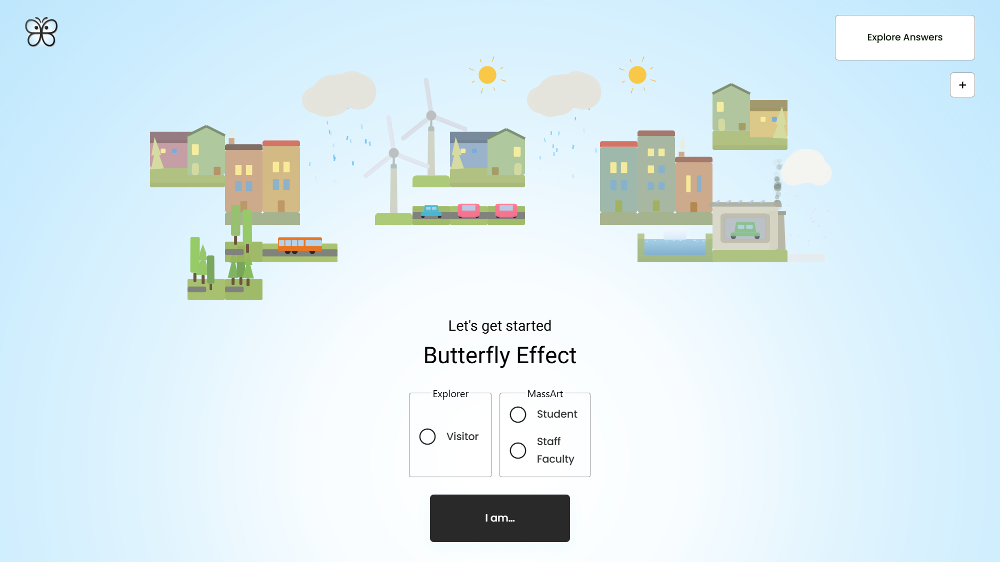

# 🌍 Participatory Climate App — 3D Interactive Survey Experience

<div style="display: flex; justify-content: center; gap: 1rem; flex-wrap: wrap;">
  <div>
    
    
  </div>
  <div>
    
    
  </div>
</div>


**Participatory Climate App** is a fully interactive web application that visualizes survey results about climate change in a **gamified 3D environment**.  

After completing a short climate survey, users receive **personalized feedback** represented through color-coded, world-anchored cards — and can explore **other participants’ results** in a live, orbitable 3D world.

---

## 🎮 Features

- 🧩 **Gamified Feedback Cards**  
  Personalized results based on each answer — with adaptive gradients, contextual tone, and subtle motion.

- 🌐 **3D Visualization with Three.js & React Three Fiber**  
  Explore other survey takers’ results floating in space — orbit, zoom, and interact with dynamic nodes powered by custom layout logic.

- 🖼️ **Custom 2D Canvas Engine**  
  A lightweight, hand-built engine (not dependent on p5.js or PixiJS) for rendering animated environmental shapes like clouds, houses, buses, and trees.

- 🧭 **Responsive & Touch-Ready UI**  
  Pinch-zoom, drag, rotate, and toggle elements fluidly — optimized for accessibility and motion-comfort.

- ⚙️ **Dynamic Offset Anchoring System**  
  Keeps 2D DOM elements visually attached to their 3D anchors, even during camera motion.  
  Handles viewport edge cases automatically using `.is-top`, `.is-bottom`, etc. classes.

---

## 🧠 Technical Highlights

```markdown
### 🎯 Bridging 3D Context with React DOM

The app integrates **Three.js (via React Three Fiber)** and **React DOM** through a custom anchoring system.  
Normally, `@react-three/drei`’s `Html` component struggles to keep labels aligned during camera motion.  
This project introduces a **dynamic offset value system** to preserve spatial alignment and visual consistency.

    transform: translateX(var(--offset-px));

This allows each element to stay visually locked to its projected 3D anchor — even while orbiting or zooming — preventing UI “float” drift that usually breaks immersion.

🏙️ **Procedural City Generation Engine**

A procedural City Engine governs every structure, vehicle, and environmental shape based on the user’s `liveAvg`.  
It uses a **Condition Planner System (A–D)** with quota curves, shape footprints, and per-band rules that automatically rebalance across viewports (start, questionnaire, overlay).

🧩 **Adaptive Grid & Placement Logic**

A logical grid abstracts the viewport into responsive “cells”:

- Dynamic row/column count derived from screen dimensions  
- Per-shape forbidden zones for spatial clarity  
- Deterministic pseudo-randomness for organic variation  

This enables a natural yet reproducible layout of city elements — purely procedural, no physics required.  
In **overlay mode**, the centering bias is disabled to let `RowRules` fully dictate placement, resulting in a more cinematic spread.

🎨 **Dual Rendering Pipelines (DOM + Canvas)**

The app blends **React DOM** for interactivity and a **Q5-based Canvas Engine** for the visual world.  
Both share global state through `GraphContext`, allowing smooth continuity between the questionnaire, overlay, and results — keeping the city simulation persistent across phases.

⚙️ **Deterministic World Planning**

Every element’s position is reproducible, generated via hashed IDs:

    const key = `${shape}|${row},${col}`;
    const rand = hash32(key) / 0xffff;

This guarantees consistent yet natural variety between sessions.

🌤️ **Gradient & Environmental Reactivity**

In overlay mode, a bottom-to-top gradient dynamically shifts hue based on the user’s `liveAvg`.  
The base color intensifies according to survey sentiment — cool blues for low averages, warm ambers for high — while fading to transparent near the top, blending data and emotion into atmosphere.

🧱 **Engine Architecture for Extensibility**

The system operates as a mini engine, not a static animation.  
Adding a new environment type or shape is as simple as defining its footprint and quota — the engine automatically handles placement, scaling, and spatial logic.

    { shape: 'tower', footprint: { w: 1, h: 4 } }

Everything else — positioning, balancing, and color blending — is procedurally resolved.

🧩 **Stack**

- React + TypeScript  
- React Three Fiber / Drei  
- Custom Q5 Engine (procedural 2D rendering)  
- Framer Motion  
- Context API  
- CSS Grid / Tailwind principles  

🚀 **Local Setup**

    git clone https://github.com/yourusername/participatory-climate-app
    cd participatory-climate-app
    npm install
    npm run dev

Then open [http://localhost:3000](http://localhost:3000) in your browser.

✨ **Vision**

The project bridges data, storytelling, and interactivity — turning climate perception into a tangible, explorable world.  
It’s not just a survey — it’s a participatory landscape that visualizes how we feel about the planet.

🧭 **Development Philosophy**

This app was designed as both a tool and a canvas — an engine that merges data visualization with emotion.  
Every architectural decision aims to keep the system reactive, procedural, and human:

- Reactive systems > scripted animations  
  The world doesn’t play back — it *responds* to live data.

- Minimal dependencies, maximal flexibility  
  The canvas engine is written from scratch for precise control over rendering and motion.

- Extensible at the rule level  
  Adding a new condition or city element requires no structural rewrite — only new rule definitions.

The result is a living interface — part visualization, part expression, and entirely driven by human input.

> “Instead of showing charts about climate — we built a world that feels it.”
```
