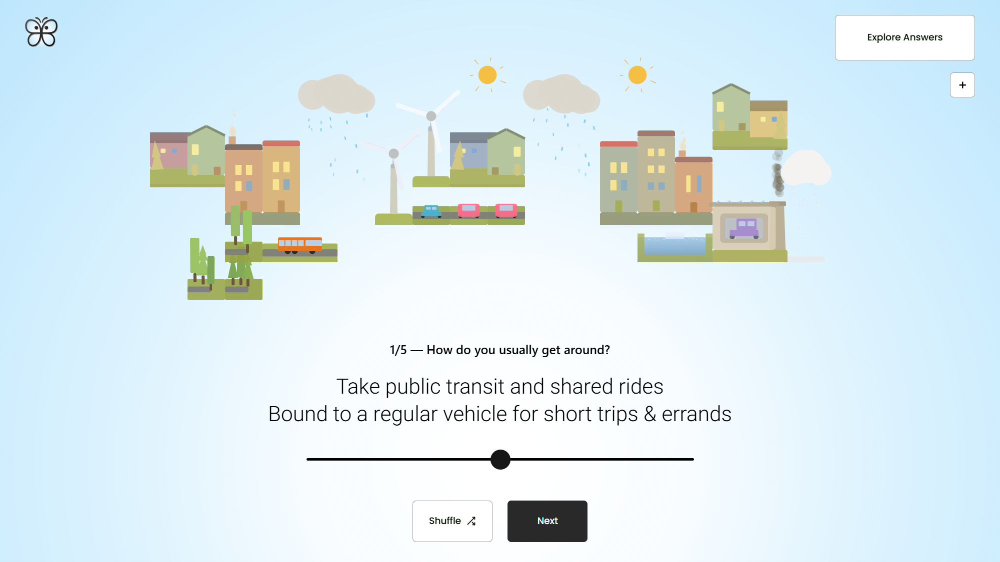
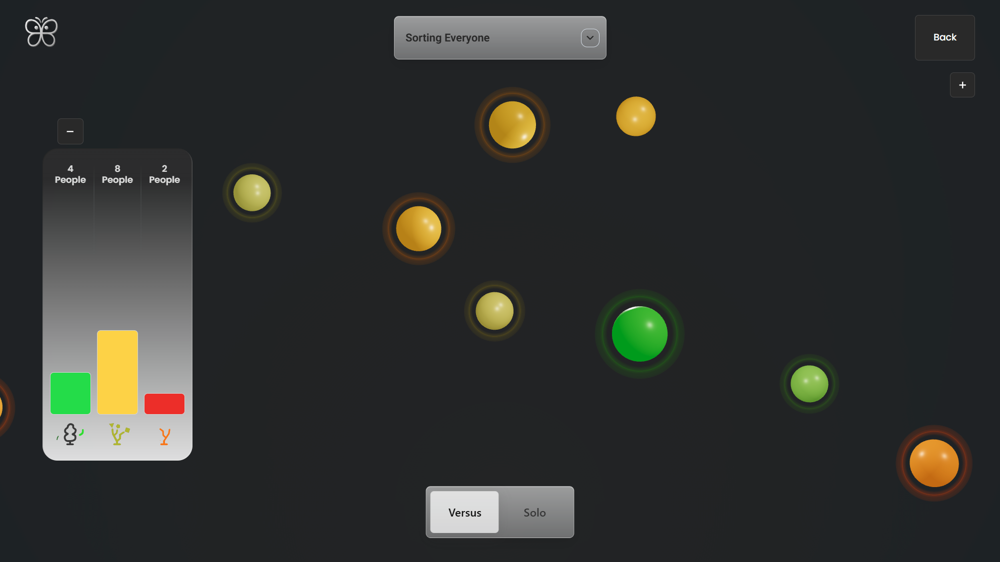

# Participatory Climate App

<div style="display: flex; justify-content: center; gap: 1rem; flex-wrap: wrap;">
  <div>
    
    
    
    
  </div>
</div>

**Participatory Climate App** visualizes results of a short climate survey in an interactive 3D world.  
Users receive personalized, color-coded feedback and can explore other results in an orbitable space.

---

## Features

- **Feedback Cards:** Adaptive gradients, tone, and motion.  
- **3D Visualization:** Three.js + React Three Fiber; orbit/zoom; dynamic nodes.  
- **Custom 2D Canvas:** Lightweight engine (no p5.js/PixiJS) for animated shapes.  
- **Touch-Ready UI:** Pinch-zoom, drag, rotate; accessibility-friendly.  
- **Anchoring System:** DOM labels stay aligned to 3D anchors during camera motion.

---

## Technical Highlights

### Bridging 3D and DOM

The app integrates **Three.js (via React Three Fiber)** with **React DOM** through a custom anchoring system.  
Unlike `@react-three/drei`’s `Html` component, this approach maintains alignment and visual stability during camera movement.

```css
transform: translateX(var(--offset-px));
```

This ensures each element remains visually locked to its projected 3D anchor, preventing UI drift and maintaining immersion.

---

## Procedural City Generation Engine

Driven by `liveAvg`.  
The system uses a **Condition Planner (A–D)** with quota curves, footprints, and per-band rules that rebalance across viewports (start, questionnaire, overlay).

---

## Adaptive Grid & Placement Logic

- Responsive grid based on screen size  
- Per-shape forbidden zones  
- Deterministic pseudo-randomness for natural variation  

No physics required.  
In overlay mode, centering bias is disabled so `RowRules` can create a cinematic spread.

---

## Dual Rendering Pipelines (DOM + Canvas)

**React DOM** handles interactivity, while a **Q5-based Canvas Engine** renders visuals.  
Both share state through `GraphContext`, ensuring the city remains persistent across all phases.

---

## Deterministic World Planning

Procedural positions are generated using hashed IDs for consistent, reproducible layouts.

```js
const key = `${shape}|${row},${col}`;
const rand = hash32(key) / 0xffff;
```

This guarantees stable, deterministic world generation between sessions.

---

## Gradient & Environmental Reactivity

In overlay mode, the gradient hue shifts dynamically based on the user’s `liveAvg`.  
Cool blues represent lower averages, while warm ambers indicate higher ones — blending emotion with data.

---

## Engine Architecture & Extensibility

The system operates as a **modular engine**, not a static animation.  
Adding a new shape requires only defining its footprint and quota — positioning, scaling, and blending are handled automatically.

```js
{ shape: 'tower', footprint: { w: 1, h: 4 } }
```

---

## Stack

- React + TypeScript  
- React Three Fiber / Drei  
- Custom Q5 Engine (procedural 2D rendering)  
- Sanity.io (content & survey data)  
- Context API  
- Lottie.js  
- CSS Flexbox

---

## Local Setup

```bash
git clone https://github.com/EfeOzalpp/Exploratory-Interactive-WebApp
cd Exploratory-Interactive-WebApp
npm install
npm run dev
```

Then open [http://localhost:3000](http://localhost:3000) in your browser.

---

## Vision

This project bridges data, storytelling, and interactivity — turning climate perception into an explorable world.  
It’s not just a survey; it’s a participatory landscape that visualizes how people feel about the planet.

---

## Development Philosophy

The app was designed as both a **tool and a canvas**, merging data visualization with emotion.  
Every architectural choice aims to keep the system procedural, reactive, and human.

### Guiding Principles

- **Reactive systems > scripted animations**  
  The world doesn’t play back; it responds to live data.

- **Minimal dependencies, maximal flexibility**  
  The rendering engine was built from scratch for precision and control.

- **Extensible rule-level architecture**  
  Adding new conditions or city elements requires no structural rewrites.

---

The result is a living interface — part visualization, part expression, driven entirely by human input.

> “Instead of showing charts about climate, I built a world that feels it.”
